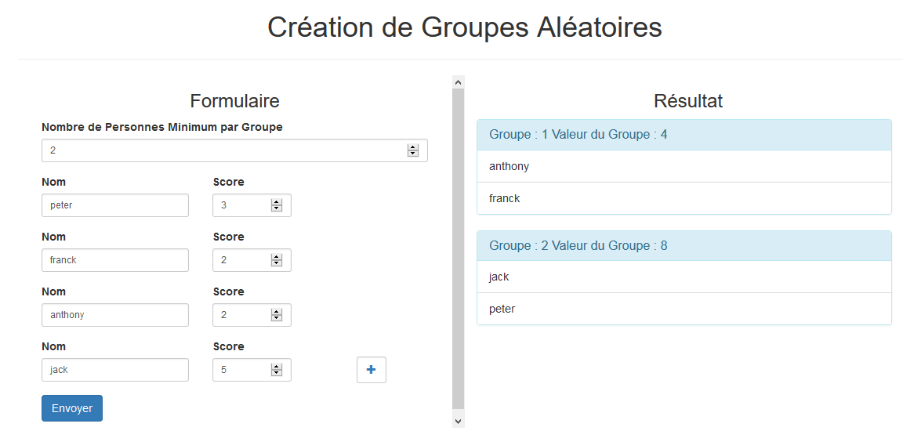

# GenGroups
[Site Web php] Génère des groupes homogènes basés sur le score de chaque individu

## Fonctionnement
On choisit le nombre d'individus par groupe ( >= 2 ).
Pour chaque individu on rentre son nom et son score. 
Le score n'a pas de limite, Il peut être de 0 à 10 comme de 0 à 100 ou meme de 50 à 500.
Apres avoir appuyé sur Envoyer, des groupes homogènes sont affichés sur le côté droit.

## Composition du projet
### Classes 
* Equipe
* Personne

### Vue
* index (Affichage de la page unique)

### Traitement
* traitement.php (Reçoit la requête Ajax, la traite et renvoie une réponse)

### Ressourses
* Fichiers Bootstrap
* mycss.css (mon css)
* myjs.js (mon javascript pour faire apparaître les champs supplémentaires et envoyer la requête Ajax)

## Formules utilisées
* nbGroupe = nbPersonne / tailleEquipe
* scoreTotal = SOMME(score chaque personne)
* scoreMoyen = scoreTotal / nbGroupe
* reste = nbPersonne % tailleEquipe
* Offset = scoreMoyen - (scoreMin + scoreMax + nbGroupe)

## A faire
* Amélioration de la formule de l'offset
* Test unitaire
* Gestion des erreures coté serveur et l'affichage coté client
* Coté client verification si 2 champs ont le meme nom
* Ajout de 2 boutons, affichage des scores des equipes et affichage des scores des elements
