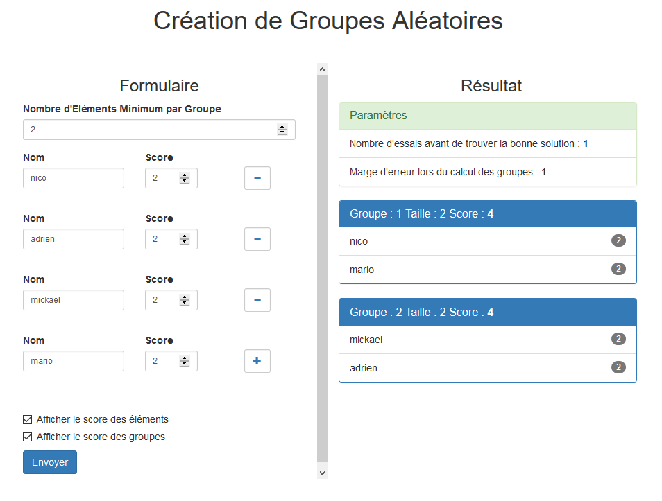

# GenGroups
[Site Web php] Génère des groupes homogènes basés sur le score de chaque individu.

## Fonctionnement
On choisit le nombre d'individus par groupe ( >= 2 ).
Pour chaque individu, on rentre son nom et son score. 
Le score n'a pas de limite, Il peut être de 0 à 10 comme de 0 à 100 ou meme de 50 à 500.
Apres avoir appuyé sur Envoyer, des groupes homogènes sont affichés sur le côté droit.

## Composition du projet

### Vue
* index.php (Affichage de la page unique)

### Controleur
* controleur.php (Reçoit la requête Ajax, la passe au traitement et renvoie une réponse)

### Model
* Traitement.php
* Equipe.php
* Personne.php
* Message.php (objet contenant les paramètres et erreurs)
* ToJson.php (interface)

### Ressourses
* Fichiers Bootstrap
* mycss.css (mon css)
* myjs.js (mon javascript pour faire apparaître les champs supplémentaires, envoyer la requête Ajax, et traiter la réponse)

## Formules utilisées
* nbGroupe = nbPersonne / tailleEquipe
* scoreTotal = SOMME(score chaque personne)
* scoreMoyen = scoreTotal / nbGroupe
* reste = nbPersonne % tailleEquipe
* Offset = scoreMoyen - (scoreMin + scoreMax + nbGroupe)

## A faire
* Amélioration de la formule de l'offset
* Test unitaire
* Affichage des erreurs du controleur
* Refaire l'image du readme
* Focus sur un champ quand on ajoute un champ
* Possibilité d'imprimer

:octocat: